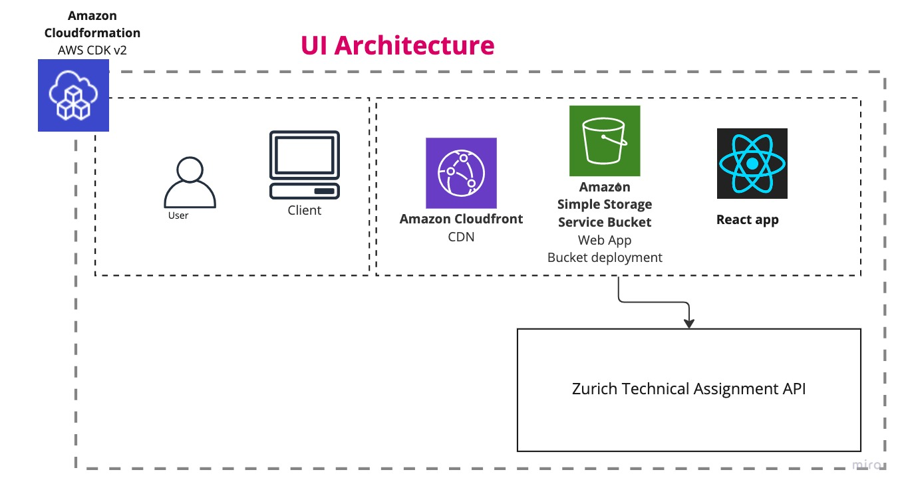
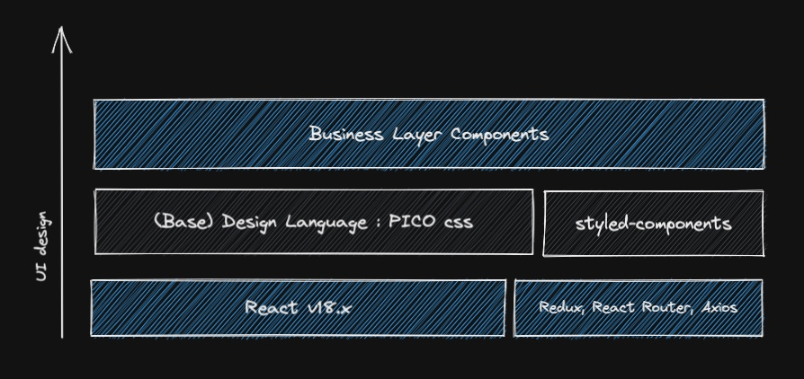
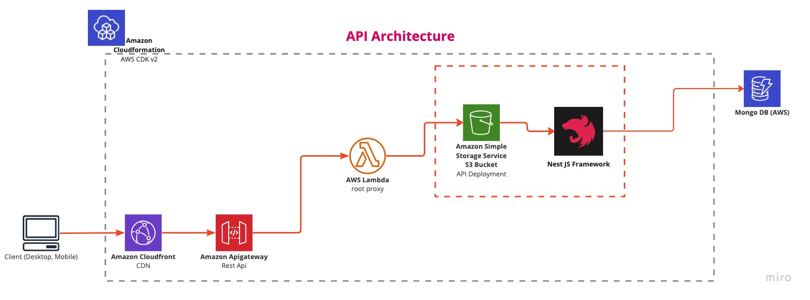
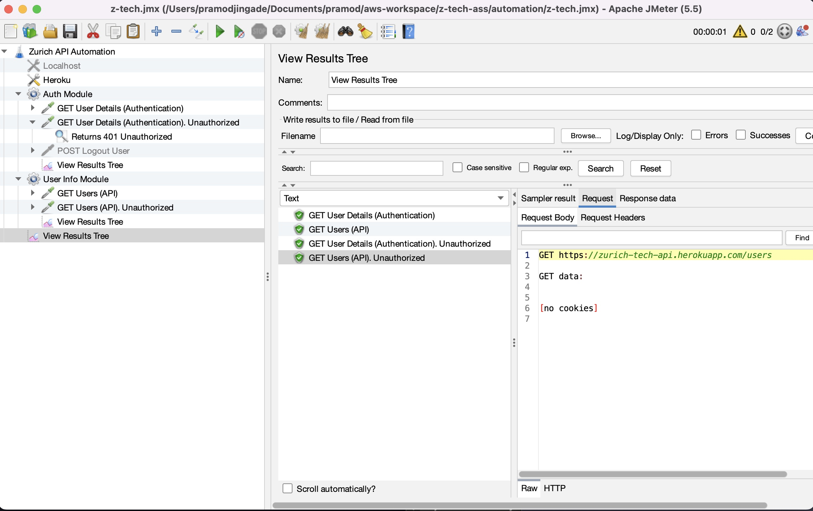
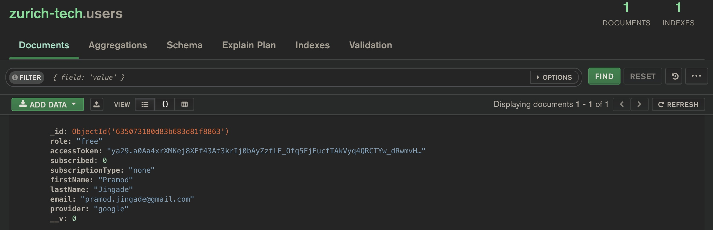

# Zurich Technical Assignment

- [Demo Website Link (AWS Cloudfront)](https://d11ormolj9shwt.cloudfront.net/#/)

This project aims in creating a Web Application to meet the requirements of the UI technical assignment. **Built entirely with Typescript !!**

# TLDR;

# Technical Assignments (with description)

_With this in mind, Zurich is concerned about:_
-  _React hosting solutions_
	- I decided to use AWS CDK (Cloudformation) to deploy React as a SPA
- _React security, how to secure home page from unauthorized access_
	- Using JWT Session Token (provided by Google OAuth 2.0 Redirect)
- _Proper used of React Redux reducer and actions_
	- Please find all redux store and reducers under `ui/src/commons/state` folder
- _Reusable react components_
	- All components are reusable and can be found in `ui/src/components` folder
- _How to make secure API call from react which require authentication_
	- I used `NestJS` + `Mongo DB` + `Google OAuth 2.0 URI Redirect`

# Important Links

- [Link to the Technical Assignment](https://d11ormolj9shwt.cloudfront.net/#/)
- Links to API Swagger documentation
	- [Users Module](https://zurich-tech-api.herokuapp.com/swagger/api/users/)
	- [Auth Module](https://zurich-tech-api.herokuapp.com/swagger/api/auth/)
	- [Health Module](https://zurich-tech-api.herokuapp.com/swagger/api/health/)
- [Nest JS](https://nestjs.com)
- [Create React App Template](http://create-react-app.dev/)
- [AWS CDK v2 Documentation](https://docs.aws.amazon.com/cdk/api/v2/)
- [Deployment Serverless API with NestJS and AWS CDK](https://medium.com/nextfaze/deploying-serverless-api-with-nestjs-and-aws-cdk-3d41063543e0)
- [Mongo DB Atlas](https://account.mongodb.com)

# Design and Architecture

This Project (app) is built by leveraging IaaS (Infrastructure as a Service). The framework used is AWS CDK v2 (which is built on top of cloudformation and written in Typescript). 

## Infrastructure

- AWS CDK v2, makes it easy to scaffold on AWS cloud using Level 2 constructs. 
- Using AWS CDK v2, you can easily maintain AWS Cloud resources under a single stack (Cloudformation stack) 
- You can unit test your Tech stack, to make sure the right resources (and right count) are being deployed. which is a huge benefit
	- npm run test
- The CDK CLI offers easy to use build scripts to Create, Scale and Destroy all resources under a particular stack, 
	- cdk bootstrap
	- cdk synth
	- cdk deploy
- If setup correctly, The stacks can be deployed individually or as a whole

## Frontend / UI Layer Architecture and Tech Stack

The Frontend is built using React v18.x and Redux (in Typescript). On the infrastructure, it consists of a S3 bucket hosting React App, connected to cloud front and served on HTTPS.

### Technology Stack used

- React v18.x - scaffolding using `create-react-app`
- Typescript 
- Redux - State management library
- React Router Dom - Client side routes
- Axios - Making Async calls to the Server
- PicoCSS - Lightweight UI design library, great for POCs
- Styled Components - Styling component library
- Toastify - Notification library
- Jest - All Unit testing is done using Jest
- Github Actions (UI_test.yml) - Created a Github workflow to show build is passing and show the coverage
- AWS CDK v2 - Hosting

### How to run it and deploy

- Navigate to the project root folder `<root-folder>/ui`
- Run `npm i`
- Run `npm start`
- In order to deploy, I have setup automation shell scripts under `<root-folder>/automation/scripts`
- Run `zsh ui-clean.sh` to clean src files
- Run `zsh ui-build.sh` to create a new build
- Run `zsh ui-deploy.sh` which copies it into aws -> `build` folder
- Then run `cdk deploy --ZurichTechSiteStack`

## Backend / API Layer Architecture

The Backend API / Rest service is built using Nest JS. On the infrastructure, it consists of a S3 bucket for hosting and Lambda services and Apigateway which act as a proxy to the request response going in and out of Nest JS.

The API is located under the following path:
`./aws/lambda/api/`

> NOTE: The Nest JS 

### Technology Stack Used

- NestJS v8.x - Restful API framework
- Typescript 
- MongoDB Cloud - Database persistance layer 
- OAuth2.0 Google strategy - OAuth2.0 sign on using Google
- cross fetch - Node JS client library for making Async calls to 3rd party API
- aws-lambda - AWS proxy server to the root API
- esbuild - Javascript deployment library to AWS cloud
- Jest - All Unit testing is done using Jest
- Github Actions (API_test.yml) - Created a Github workflow to show build is passing and show the coverage
- AWS CDK v2 - Hosting

> NOTE: for the sake of the demo, I had to deploy the API on `Heroku Cloud` since I had some last minute problems transitioning the API code from AWS CDK v1.168.0 to AWS CDK v2.0. But I've provided the API cloudformation template along with API code in `aws` folder

The RESTful API code is located at `/aws/lambda/api`

### How to run it and deploy

- Navigate to the project root folder `<root-folder>/aws/lambda/api/`
- Run `npm i`
- Run `npm start:dev` to run it locally on port 3001
- In order to deploy, I have setup automation shell scripts under `<root-folder>/automation/scripts`
- Run `zsh api-clean.sh` to clean src files
- Run `zsh api-build.sh` to create a new build
- Then run `cdk deploy --ZurichTechAPIStack` to deploy to AWS cloud

## Testing and Automation

### Unit Testing

Both the frontend and API were built using `Test driven development` approach. Given the timeframe, I have not been able to achieve >80% code coverage but written just enough to touch every aspect of code. 😅

- Unit Testing & Code coverage reports for UI can be found in the repository > actions > `Run UI Unit Test`
- Unit Testing & Code coverage reports for API can be found in the repository > actions > `Run API Unit Test`
- ❗Unit Testing & Code coverage for AWS cloudformation has to be run locally, Github has problems setting up the AWS env on the cloud.
	- Navigate to `aws/`
	- run `npm i`
	- run `npm run test` to see the unit test result.

### Automation
- I used `JMeter` to show the API Automation. The JMeter file can be found in - `automation/z-tech.jmx`

### Swagger Documentation

Nest JS framework provides good support for OpenAPI specification.
- Links to API Swagger documentation
	- [Users Module](https://zurich-tech-api.herokuapp.com/swagger/api/users/)
	- [Auth Module](https://zurich-tech-api.herokuapp.com/swagger/api/auth/)
	- [Health Module](https://zurich-tech-api.herokuapp.com/swagger/api/health/)

# Challenges Faced

- I had trouble deploying the API to AWS cloud in the given timeframe mainly due to -
	- the cloudformation template I was using earlier to deploy were all AWS CDK v1.168.x
	- I encountered deployment errors especially on the API side, so as last minute effort deploy the code to heroku to show it works
- Unnecessary use of a DB - 
	- right now the Mongo DB is used purely to store the users who sign up for the first time, this is not required but for the sake of simplicity I added in Mongo DB

	- The DB doesn't store `any sensitive` information apart from Google email and first and last name and the jsonwebtoken that Google provides
- Split architecture
	- I typically use the API to statically serve the UI in the same location as the API server. This is because I can make use of `cookies` for session storage
	- Due to the assignment requesting use of AWS, I had to split the frontend and API into 2 cloudformation templates
	- This would mean I cannot make use of Cookies to communicate session between the server and the client
	- I send the JSON token as part of the URL and the React application has a React hook to read it and store as part of the localStorage
	- JSON web tokens are `URL safe!!` plus they have expiry time of 24 hours `{exp: '24h'}`
	

