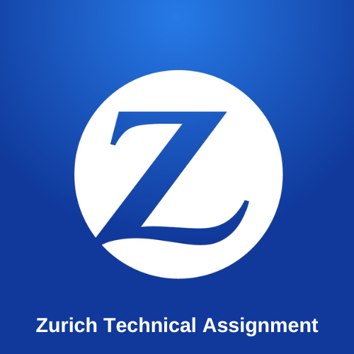

# Zurich Technical Assignment
- 
- [Demo Website Link (AWS Cloudfront)](https://d11ormolj9shwt.cloudfront.net/#/)

This project aims in creating a Web Application to meet the requirements of the UI technical assignment. **Built entirely with Typescript !!**

# TLDR;

# Technical Assignments (with description)

_With this in mind, Zurich is concerned about:_
-  _React hosting solutions_
	- I decided to use AWS CDK (Cloudformation) to deploy React as a SPA
- _React security, how to secure home page from unauthorized access_
	- Using JWT Session Token (provided by Google OAuth 2.0 Redirect)
- _Proper used of React Redux reducer and actions_
	- Please find all redux store and reducers under `ui/src/commons/state` folder
- _Reusable react components_
	- All components are reusable and can be found in `ui/src/components` folder
- _How to make secure API call from react which require authentication_
	- I used `NestJS` + `Mongo DB` + `Google OAuth 2.0 URI Redirect`

# Important Links

- [Link to the Technical Assignment](https://d11ormolj9shwt.cloudfront.net/#/)
- Links to API Swagger documentation
	- [Users Module](https://zurich-tech-api.herokuapp.com/swagger/api/users/)
	- [Auth Module](https://zurich-tech-api.herokuapp.com/swagger/api/auth/)
	- [Health Module](https://zurich-tech-api.herokuapp.com/swagger/api/health/)
- [Nest JS](https://nestjs.com)
- [Create React App Template](http://create-react-app.dev/)
- [AWS CDK v2 Documentation](https://docs.aws.amazon.com/cdk/api/v2/)
- [Deployment Serverless API with NestJS and AWS CDK](https://medium.com/nextfaze/deploying-serverless-api-with-nestjs-and-aws-cdk-3d41063543e0)
- [Mongo DB Atlas](https://account.mongodb.com)

# Design and Architecture

This Project (app) is buit by leveraging IaaS (Infrastructure as a Service). The framework used is AWS CDK v2 (which is built on top of cloudformation and written in Typescript). 

## Infrastructure

- AWS CDK v2, makes it easy to scaffold on AWS cloud using Level 2 constructs. 
- Using AWS CDK v2, you can easily maintain AWS Cloud resources under a single stack (Cloudformation stack) 
- You can unit test your Tech stack, to make sure the right resources (and right count) are being deployed. which is a huge benefit
	- npm run test
- The CDK CLI offers easy to use build scripts to Create, Scale and Destroy all resources under a particular stack, 
	- cdk bootstrap
	- cdk synth
	- cdk deploy
- If setup correctly, The stacks can be deployed individually or as a whole

## Frontend / UI Layer Architecture and Tech Stack

The Frontend / UI Layer of the solution.

## Backend / API Layer Architecture

